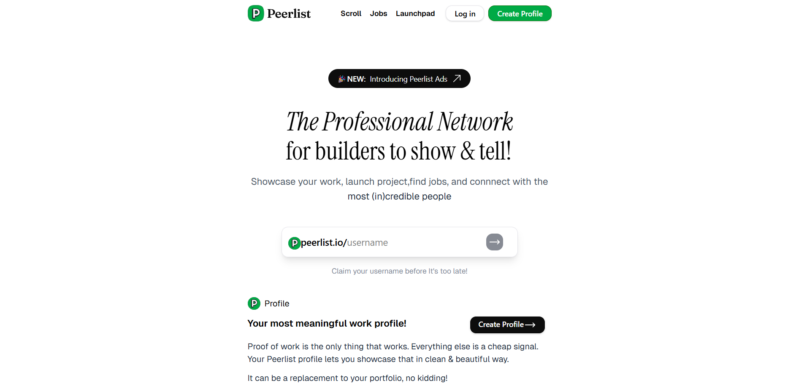
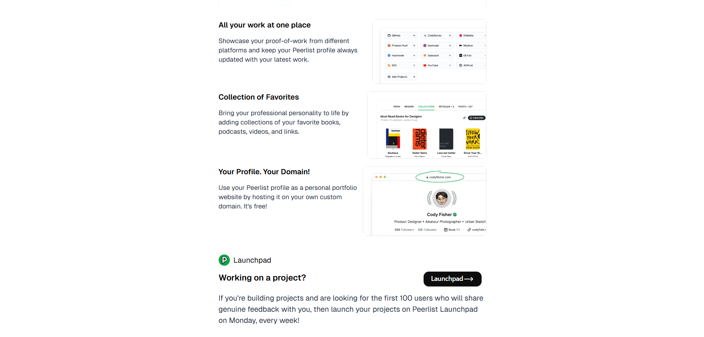

# Peerlist Landing Page Clone

A clean and modern landing page inspired by **Peerlist**, built using React and Tailwind CSS.

Live Demo: https://peerlist-clone-omega.vercel.app/  
GitHub Repo: https://github.com/furishere/peerlist-clone  

---

## About the Project

This project is a **frontend clone of the Peerlist landing page**.

Peerlist is a professional network for developers and creators where users can showcase their work, projects, and portfolios in a clean and meaningful way. 

The goal of this project was to:
- Practice modern UI development
- Improve Tailwind CSS skills
- Understand layout structuring in React
- Recreate a real-world product design

---

## Tech Stack

-  React (Vite)
-  Tailwind CSS
-  JavaScript (ES6+)

---

## Features

-  Clean and modern UI
-  Pixel-inspired design from Peerlist
-  Fast and lightweight
-  Component-based architecture

> Note: This project is currently **not responsive**.

---

## Screenshots

